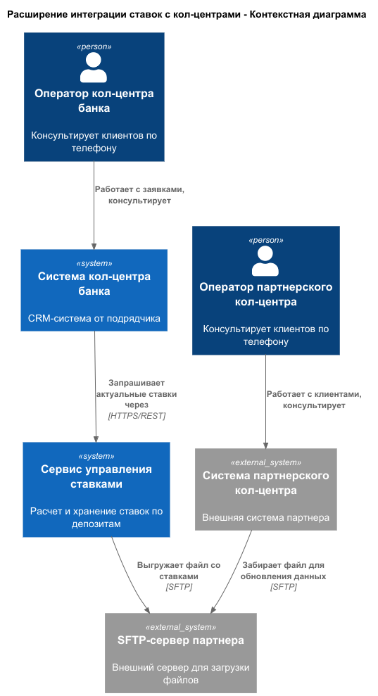
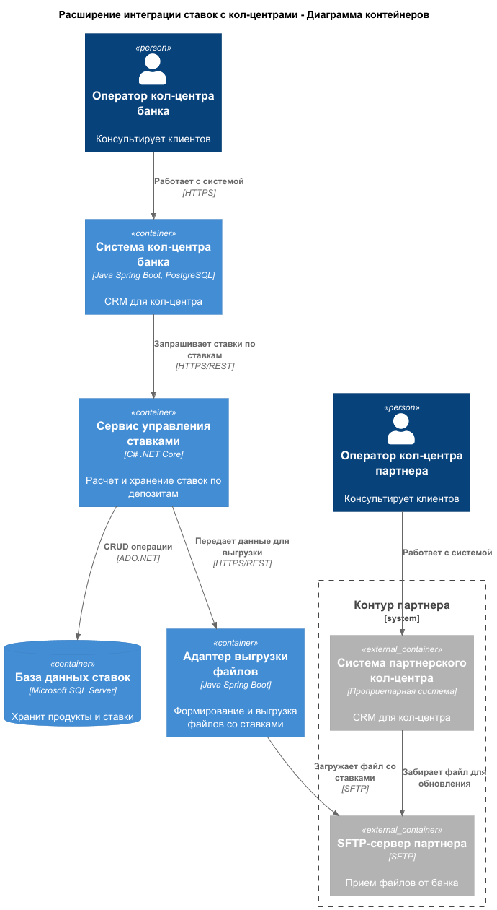

### <a name="_b7urdng99y53">Название задачи:</a> Расширение Архитектура MVP для интеграции ставок с кол-центрами банка и партнера
### <a name="_hjk0fkfyohdk">Автор:</a> Главный архитектор 
### <a name="_uanumrh8zrui">Дата:</a> 31.01.2026
### <a name="_3bfxc9a45514">Функциональные требования</a>
Опишите здесь верхнеуровневые Use Cases. Их нужно оформить в виде таблицы с пошаговым описанием:

| **№** | **Действующие лица или системы**                          | **Use Case**                                                | **Описание**                                                                                                                                                                                                                                                                                                                                                                                                                                                                                  |
|:-----:|:----------------------------------------------------------|:------------------------------------------------------------|:----------------------------------------------------------------------------------------------------------------------------------------------------------------------------------------------------------------------------------------------------------------------------------------------------------------------------------------------------------------------------------------------------------------------------------------------------------------------------------------------|
|  UC1  | Оператор кол-центра банка, Кол-центр банка, Сервис ставок | Консультация клиента по актуальным ставкам                  | 1. Клиент звонит в кол-центр банка с вопросом о ставках по депозитам. 2. Оператор открывает интерфейс системы кол-центра. 3. Система кол-центра запрашивает актуальные ставки у Сервиса ставок через REST API. 4. Оператор видит список ставок в реальном времени и консультирует клиента.                                                                                                                                                                                           |
|  UC2  | Сотрудник кол-центр партнера, Кол-центр партнера          | Консультация клиента по актуальным ставкам                  | 1. 1. Клиент звонит в партнерский кол-центр. 2. Сотрудник открывает систему кол-центра партнера. 3. Сотрудник видит актуальные (на момент последней выгрузки) ставки и консультирует клиента.                                                                                                                                                                                                                                                                                           |
|  UC3  | Сервис ставок, Кол-центр партнера                         | Автоматическая выгрузка ставок для партнерского кол-центра  | 1. Сервис ставок периодически (например, ежедневно) формирует файл с актуальными ставками в согласованном формате (JSON/XML/CSV). 2. Сервис ставок загружает файл на SFTP-сервер партнерского кол-центра. 3. Система кол-центра партнера забирает файл с SFTP и обновляет внутренние справочники.                                                                                                                                                                                       |

### <a name="_u8xz25hbrgql">Нефункциональные требования</a>
Опишите здесь нефункциональные требования и архитектурно значимые требования.

| **№** | **Требование**                                                                                                                    | 
|:-----:|:----------------------------------------------------------------------------------------------------------------------------------|
| NFR1  | Выгрузка файла для партнерского кол-центра должна происходить минимум раз в день и при каждом изменении ставок                    |
| NFR2  | Передача файлов должна быть защищена (аутентификация по SSH-ключам, шифрование по SFTP)                                           |
| NFR3  | Формат файла и его структура должен быть согласован и документирован для партнера                                                 |
| NFR4  | Ставки для кол-центра банка должны быть доступны в реальном времени                                                               |

### <a name="_qmphm5d6rvi3">Решение</a>
Приведите диаграммы контекста и контейнеров в модели C4. Опишите там основные компоненты иht интеграции всех элементов решения. 

Также опишите, какой логикой вы руководствовались в ходе принятия решений и выбора технологий. Не забывайте, что необходимо учесть все функциональные и нефункциональные требования.

1) Создан отдельный Адаптер выгрузки файлов, а не добавление функционала в Сервис ставок. Это соответствует принципу единственной ответственности и упрощает поддержку.
2) Адаптер выгрузки может формировать файлы в разных форматах: JSON/XML/CSV, в зависимости от требований.
3) Для кол-центра банка изменений не требуется, т.к. он уже интегрирован с Сервисом ставок.  
4) Использование SFTP с аутентификацией по SSH-ключам обеспечивает безопасную передачу файлов во внешнюю систему.

### <a name="_bjrr7veeh80c">Альтернативы</a>
Опишите здесь наиболее важные альтернативные решения.

**Недостатки, ограничения, риски**

Подробно опишите здесь недостатки, ограничения и риски выбранного решения.

### Альтернатива 1: Прямое доступ партнерского кол-центра до REST API Сервиса ставок
**Описание:** Предоставить партнерскому кол-центру доступ к REST API Сервиса ставок через VPN.

**Недостатки, ограничения, риски:**
 - Требует настройки безопасного канала VPN, что сложнее SFTP.
 - Требует открытия доступа извне к инфраструктуре банка.
 - Создает дополнительную нагрузку на API в реальном времени.

### Альтернатива 2: Размещение файлов на SFTP-сервера в контуре банка
**Описание:** Банк размещает файлы на своем SFTP-сервере, партнер забирает их оттуда.

**Недостатки, ограничения, риски:**
 - Требует открытия доступа извне к инфраструктуре банка
 - Дополнительная нагрузка на IT-отдел банка для поддержки SFTP-сервера

### Альтернатива 3: Использование email для рассылки файлов
**Описание:** Отправка файлов со ставками на email партнера.

**Недостатки, ограничения, риски:**
 - Ограничения на размер файлов, попадание писем в спам-фильтры.
 - Нет гарантии доставки и контроля получения

### <a name="_bjrr7veeh80c">Недостатки, ограничения, риски выбранного решения</a>

1) Данные в партнерском кол-центре могут быть не совсем актуальными (обновляются раз в день).
2) Нельзя контролировать, как и когда партнер обновляет свои данные из файла.

### <a name="_bjrr7veeh80c">Список задач</a>

| **№** |        **Система**         | **Описание задачи**                                                           | 
|:-----:|:--------------------------:|:------------------------------------------------------------------------------|
|  T1   |      Кол-центр банка       | Доработка интерфейса для отображения актуальных ставок                        |
|  T2   | Сервис управления ставками | Создание административного интерфейса для управления выгрузками               |
|  T3   | Сервис управления ставками | Реализация интеграции с адаптером выгрузки файлов                             |
|  T4   | Сервис управления ставками | Настройка планировщика задач для периодической выгрузки                       |
|  T5   | Сервис управления ставками | Реализация механизма уведомлений об ошибках выгрузки                          |
|  T6   |  Адаптер выгрузки файлов   | Разработка адаптера                                                           |
|  T7   |  Адаптер выгрузки файлов   | Реализация выгрузки данных в различных форматах (JSON/XML/CSV)                |
|  T8   |  Адаптер выгрузки файлов   | Реализация интеграции с SFTP-сервером партнера (безопасный доступ, SSH-ключи) |

### <a name="_bjrr7veeh80c">RoadMap на 6 месяцев</a>

[Roadma](RoadMap_bank_Standart.drawio)

